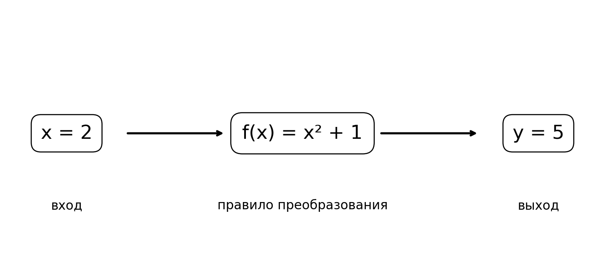
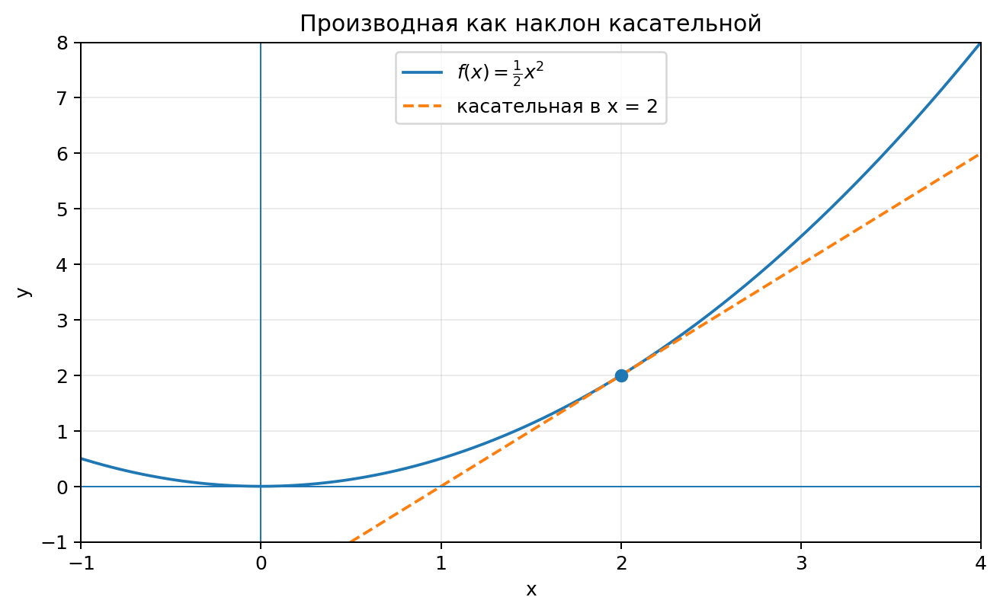
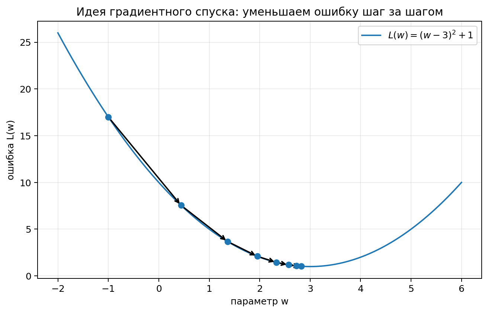

# Функции и производные: как математика помогает обучать модели

Искусственный интеллект часто воспринимают как набор сложных алгоритмов, которые «сами учатся» на данных. За этой формулировкой скрывается вполне конкретная математика. Модель получает числа, преобразует их по некоторому правилу и выдаёт результат. Затем мы сравниваем этот результат с правильным ответом и пытаемся изменить модель так, чтобы в следующий раз она ошиблась меньше.

Чтобы понять этот процесс, достаточно начать с двух идей: **функции** и **производной**. Функция описывает, как из входных данных получается результат. Производная показывает, как быстро этот результат меняется, если немного изменить вход или параметры модели. Именно поэтому производные лежат в основе одного из главных способов обучения нейросетей — градиентного спуска.

В этой главе мы последовательно разберём функции, графики, скорость изменения, производную, цепное правило и покажем, как из этих идей возникает обучение простой модели.

---

## 1. Функция как правило преобразования

Функция — это правило, которое каждому допустимому входному значению сопоставляет выходное значение.

Обычно функцию записывают так:

```math
y=f(x).
```


Здесь $x$ называют **аргументом** функции, а $f(x)$ — **значением функции**.

Например, пусть

```math
f(x)=x^2+1.
```


Чтобы найти значение функции при $x=2$, нужно подставить число $2$ вместо $x$:

```math
f(2)=2^2+1=5.
```


При $x=-3$ получим

```math
f(-3)=(-3)^2+1=10.
```


Функцию удобно представлять как устройство, которое получает вход и превращает его в выход.



Эта идея важна для искусственного интеллекта. Любую модель можно рассматривать как функцию:

```math
\text{входные данные} \longrightarrow \text{модель} \longrightarrow \text{результат}.
```


Если модель определяет, есть ли на фотографии кошка, её входом является набор чисел, описывающих пиксели, а выходом может быть число от $0$ до $1$, которое интерпретируется как уверенность модели.

Если модель оценивает стоимость квартиры, входом могут быть площадь, этаж, число комнат и район, а выходом — прогноз цены.

### Пример: простейшая модель цены

Пусть модель использует только площадь квартиры и имеет вид

```math
\hat y=3x+20,
```


где $x$ — площадь в условных десятках квадратных метров, а $\hat y$ — прогноз цены в условных единицах.

Если $x=4$, то

```math
\hat y=3\cdot4+20=32.
```


Число $3$ показывает, насколько изменится прогноз при увеличении $x$ на единицу, а число $20$ задаёт базовый уровень прогноза.

В машинном обучении такие числа называются **параметрами модели**. Обычно их обозначают буквами $w$ и $b$:

```math
\hat y=wx+b.
```


Во время обучения модель пытается подобрать такие $w$ и $b$, при которых предсказания становятся как можно ближе к правильным ответам.

---

## 2. Способы задания функции

Функцию можно задавать по-разному. Формула — только один из способов.

### 2.1. Формула

Например,

```math
f(x)=2x-1.
```


По формуле легко вычислять значения функции для любых допустимых $x$.

### 2.2. Таблица

| $x$ | $f(x)$ |
|---:|---:|
| $0$ | $-1$ |
| $1$ | $1$ |
| $2$ | $3$ |
| $3$ | $5$ |

Таблица особенно удобна, когда функция получена из измерений или экспериментов.

### 2.3. График

График функции показывает пары $(x,f(x))$ на координатной плоскости. По графику можно видеть, где функция растёт, где убывает, где достигает больших или малых значений.

В анализе данных графики особенно важны: они позволяют быстро увидеть закономерности, выбросы и необычное поведение модели.

### 2.4. Алгоритм

Функция не обязана иметь короткую формулу. Например, компьютерная программа может получить фотографию, выполнить сотни преобразований и вернуть вероятность того, что на изображении автомобиль. Такая программа тоже реализует функцию, хотя её нельзя удобно записать одной строкой.

---

## 3. Область определения и область значений

Не любое число можно подставить в любую функцию.

**Область определения** — множество допустимых значений аргумента.

Рассмотрим функцию

```math
f(x)=\frac{1}{x}.
```


При $x=0$ выражение не имеет смысла, поэтому ноль не входит в область определения.

Для функции

```math
f(x)=\sqrt{x}
```


в рамках действительных чисел допустимы только $x\ge 0$.

**Область значений** — множество значений, которые функция может принимать.

Например, для

```math
f(x)=x^2
```


значения функции неотрицательны:

```math
f(x)\ge 0.
```


В машинном обучении ограничения на значения функций тоже встречаются постоянно. Например, вероятность должна лежать между $0$ и $1$, поэтому выход модели часто пропускают через специальную функцию, которая гарантирует такой диапазон.

---

## 4. Линейная функция и её смысл

Линейная функция имеет вид

```math
f(x)=kx+b.
```


Её график — прямая.

Число $k$ называют коэффициентом наклона. Оно показывает, как изменяется $f(x)$, когда $x$ увеличивается на единицу.

Если

```math
f(x)=2x+3,
```


то увеличение $x$ на $1$ увеличивает значение функции на $2$.

Если

```math
f(x)=-4x+7,
```


то увеличение $x$ на $1$ уменьшает значение функции на $4$.

Линейная модель — один из простейших примеров машинного обучения. Она пытается провести прямую, которая хорошо описывает зависимость между входом и целевым значением.

### Несколько входных признаков

Если признаков несколько, модель можно записать так:

```math
\hat y=w_1x_1+w_2x_2+\dots+w_nx_n+b.
```


Например, для квартиры можно использовать площадь $x_1$, число комнат $x_2$ и расстояние до центра $x_3$:

```math
\hat y=w_1x_1+w_2x_2+w_3x_3+b.
```


Каждый коэффициент показывает, насколько соответствующий признак влияет на прогноз при прочих равных условиях.

---

## 5. Нелинейные функции

Не все зависимости в природе и данных похожи на прямые. Часто изменение одного параметра влияет на результат по-разному в разных областях.

Простейший пример — квадратичная функция:

```math
f(x)=x^2.
```


Если $x$ меняется с $1$ до $2$, значение функции растёт с $1$ до $4$, то есть на $3$.

Если $x$ меняется с $4$ до $5$, значение функции растёт с $16$ до $25$, то есть уже на $9$.

Значит, скорость изменения функции зависит от того, в какой точке мы находимся.

Нейросети ценны именно тем, что могут описывать сложные нелинейные зависимости. Для этого внутри сети используются нелинейные функции активации.

### ReLU

Одна из самых известных функций активации:

```math
\mathrm{ReLU}(x)=\max(0,x).
```


Она работает очень просто:

- если $x<0$, результат равен $0$;
- если $x>0$, результат равен $x$.

Например,

```math
\mathrm{ReLU}(-3)=0,
```


```math
\mathrm{ReLU}(5)=5.
```


### Сигмоида

Сигмоидальная функция задаётся формулой

```math
\sigma(x)=\frac{1}{1+e^{-x}}.
```


Её значения всегда лежат между $0$ и $1$. Поэтому сигмоиду можно использовать, когда требуется получить число, похожее на вероятность.

---

## 6. Что значит «функция меняется»

Пусть путь автомобиля зависит от времени:

```math
s(t)=t^2.
```


В момент $t=2$ автомобиль находится в точке

```math
s(2)=4,
```


а в момент $t=5$ — в точке

```math
s(5)=25.
```


За $3$ единицы времени путь изменился на $21$ единицу. Средняя скорость равна

```math
v_{\text{ср}}=\frac{25-4}{5-2}=7.
```


Для любой функции среднюю скорость изменения на промежутке от $x_1$ до $x_2$ можно вычислить по формуле

```math
\frac{f(x_2)-f(x_1)}{x_2-x_1}.
```


Это отношение показывает, сколько единиц изменения функции приходится в среднем на одну единицу изменения аргумента.

### Геометрический смысл

На графике берут две точки

```math
A=(x_1,f(x_1)),\qquad B=(x_2,f(x_2)).
```


Прямая, проходящая через эти точки, называется **секущей**. Выражение

```math
\frac{f(x_2)-f(x_1)}{x_2-x_1}
```


задаёт наклон этой прямой.

---

## 7. От средней скорости к мгновенной

Средняя скорость не всегда отвечает на нужный вопрос. Если автомобиль разгонялся и тормозил, среднее значение не говорит, с какой скоростью он двигался в конкретный момент.

Рассмотрим функцию

```math
f(x)=x^2
```


и точку $x=2$.

Посчитаем среднюю скорость изменения на всё меньших промежутках.

От $2$ до $3$:

```math
\frac{3^2-2^2}{3-2}=5.
```


От $2$ до $2.1$:

```math
\frac{2.1^2-2^2}{2.1-2}=4.1.
```


От $2$ до $2.01$:

```math
\frac{2.01^2-2^2}{2.01-2}=4.01.
```


От $2$ до $2.001$:

```math
\frac{2.001^2-2^2}{2.001-2}=4.001.
```


Чем ближе вторая точка к первой, тем ближе результат к числу $4$.

Это число и есть производная функции $x^2$ в точке $x=2$.

---

## 8. Производная

**Производная функции в точке** показывает скорость изменения функции около этой точки.

Обозначения:

```math
f'(x)
```


или

```math
\frac{df}{dx}.
```


Формально производная определяется пределом:

```math
f'(x)=\lim_{h\to0}\frac{f(x+h)-f(x)}{h}.
```


На первом знакомстве важнее понять смысл этой записи. Мы берём очень маленькое изменение аргумента $h$ и смотрим, насколько при этом изменяется функция. Чем меньше $h$, тем точнее мы описываем изменение «прямо сейчас».

### Геометрический смысл производной

Производная в точке равна наклону касательной к графику функции в этой точке.



Если

```math
f'(x)>0,
```


то функция около этой точки возрастает.

Если

```math
f'(x)<0,
```


то функция около этой точки убывает.

Если

```math
f'(x)=0,
```


касательная горизонтальна. Такая точка может быть минимумом, максимумом или другой особой точкой.

---

## 9. Производная функции $x^2$

Выведем производную функции

```math
f(x)=x^2.
```


По определению

```math
f'(x)=\lim_{h\to0}\frac{(x+h)^2-x^2}{h}.
```


Раскроем квадрат:

```math
(x+h)^2=x^2+2xh+h^2.
```


Тогда

```math
f'(x)=\lim_{h\to0}\frac{x^2+2xh+h^2-x^2}{h}.
```


Сократим $x^2$:

```math
f'(x)=\lim_{h\to0}\frac{2xh+h^2}{h}.
```


Вынесем $h$:

```math
f'(x)=\lim_{h\to0}(2x+h).
```


При $h\to0$ получаем

```math
\boxed{f'(x)=2x}.
```


Поэтому в точке $x=2$:

```math
f'(2)=4.
```


А в точке $x=-3$:

```math
f'(-3)=-6.
```


Отрицательное значение показывает, что слева от вершины парабола убывает.

---

## 10. Основные правила дифференцирования

На практике производные редко вычисляют каждый раз по определению. Используют готовые правила.

### 10.1. Производная константы

Если

```math
f(x)=c,
```


где $c$ — постоянное число, то

```math
f'(x)=0.
```


Например,

```math
(7)'=0.
```


Постоянная функция не меняется, поэтому скорость её изменения равна нулю.

### 10.2. Степенная функция

Для

```math
f(x)=x^n
```


имеем

```math
\boxed{f'(x)=nx^{n-1}}.
```


Например,

```math
(x^3)'=3x^2,
```


```math
(x^5)'=5x^4.
```


### 10.3. Постоянный множитель

Если

```math
f(x)=c\,g(x),
```


то

```math
f'(x)=c\,g'(x).
```


Например,

```math
(4x^3)'=4\cdot3x^2=12x^2.
```


### 10.4. Сумма

Производная суммы равна сумме производных:

```math
(f(x)+g(x))'=f'(x)+g'(x).
```


Например,

```math
f(x)=3x^4-2x^2+7x-5.
```


Тогда

```math
f'(x)=12x^3-4x+7.
```


---

## 11. Как по производной искать минимум

Рассмотрим функцию

```math
f(x)=(x-3)^2+2.
```


Её график — парабола с вершиной в точке $(3,2)$.

Найдём производную:

```math
f'(x)=2(x-3).
```


В точке $x=3$:

```math
f'(3)=0.
```


Слева от $3$ производная отрицательна, поэтому функция убывает. Справа производная положительна, поэтому функция растёт. Значит, в точке $x=3$ находится минимум.

Это наблюдение важно для машинного обучения. Обучение часто сводится к поиску минимума функции ошибки.

---

## 12. Функция ошибки

Пусть модель должна предсказать число $y$, а её ответ обозначается $\hat y$.

Если правильный ответ равен $10$, а модель предсказала $8$, ошибка составляет $-2$.

Можно было бы использовать просто разность

```math
\hat y-y,
```


но положительные и отрицательные ошибки могут компенсировать друг друга. Поэтому часто используют квадрат ошибки:

```math
L=(\hat y-y)^2.
```


Буква $L$ происходит от английского слова **loss** — потеря, ошибка.

Для $y=10$:

- если $\hat y=8$, то $L=4$;
- если $\hat y=9.5$, то $L=0.25$;
- если $\hat y=14$, то $L=16$.

Чем точнее предсказание, тем меньше значение $L$.

Обучение модели можно сформулировать так:

> найти такие параметры модели, при которых функция ошибки принимает как можно меньшее значение.

---

## 13. Производная функции ошибки

Пусть простейшая модель имеет всего один параметр $w$, а функция ошибки равна

```math
L(w)=(w-4)^2.
```


Минимум очевиден: при $w=4$ ошибка равна нулю.

Найдём производную:

```math
L'(w)=2(w-4).
```


Посмотрим, что она сообщает.

При $w=1$:

```math
L'(1)=2(1-4)=-6.
```


Производная отрицательна. Это означает, что при увеличении $w$ функция ошибки уменьшается.

При $w=7$:

```math
L'(7)=2(7-4)=6.
```


Производная положительна. Значит, чтобы уменьшить ошибку, нужно двигаться в сторону меньших значений $w$.

Таким образом, знак производной указывает, в какую сторону нужно менять параметр, чтобы спускаться к минимуму.

---

## 14. Градиентный спуск в одном измерении

Один из основных алгоритмов оптимизации называется **градиентным спуском**.

В случае одного параметра его шаг можно записать так:

```math
\boxed{w_{\text{new}}=w_{\text{old}}-\eta L'(w_{\text{old}})}.
```


Здесь $\eta$ — **скорость обучения** или *learning rate*. Она определяет размер шага.

Рассмотрим функцию

```math
L(w)=(w-4)^2
```


и начальное значение

```math
w_0=1.
```


Пусть

```math
\eta=0.1.
```


Мы уже нашли

```math
L'(1)=-6.
```


Тогда

```math
w_1=1-0.1\cdot(-6)=1.6.
```


Сделаем ещё один шаг:

```math
L'(1.6)=2(1.6-4)=-4.8,
```


```math
w_2=1.6-0.1\cdot(-4.8)=2.08.
```


Параметр постепенно приближается к оптимальному значению $4$.



### Почему стоит знак минус

Производная показывает направление **роста** функции. Нам нужно уменьшать ошибку, поэтому мы двигаемся в противоположную сторону. Именно поэтому в формуле стоит знак минус.

### Почему нельзя брать слишком большой шаг

Если $\eta$ слишком велико, алгоритм может перепрыгивать минимум и даже удаляться от него. Если $\eta$ слишком мало, обучение будет очень медленным.

Это один из первых примеров важного принципа машинного обучения: недостаточно знать правильное направление, нужно ещё выбрать разумный размер шага.

---

## 15. Составные функции

Нейросеть не является одной простой формулой. Она состоит из множества последовательно применяемых преобразований.

Например,

```math
x\longrightarrow u=2x+1\longrightarrow y=u^2.
```


Если подставить первое выражение во второе, получим

```math
y=(2x+1)^2.
```


Такая функция называется **составной**.

В ней можно выделить внутреннюю функцию

```math
u(x)=2x+1
```


и внешнюю функцию

```math
y(u)=u^2.
```


Чтобы понять, как изменение $x$ влияет на $y$, нужно учесть обе стадии преобразования.

---

## 16. Цепное правило

Для составной функции действует цепное правило:

```math
\boxed{\frac{dy}{dx}=\frac{dy}{du}\cdot\frac{du}{dx}}.
```


Для нашего примера

```math
y=u^2,
```


поэтому

```math
\frac{dy}{du}=2u.
```


Также

```math
u=2x+1,
```


поэтому

```math
\frac{du}{dx}=2.
```


Следовательно,

```math
\frac{dy}{dx}=2u\cdot2=4u.
```


Возвращаемся к переменной $x$:

```math
\boxed{\frac{dy}{dx}=4(2x+1)=8x+4}.
```


Если продифференцировать раскрытое выражение

```math
y=(2x+1)^2=4x^2+4x+1,
```


получим тот же результат:

```math
y'=8x+4.
```


### Интуитивный смысл

Если изменение $x$ в два раза усиливается на первом шаге, а затем результат ещё, например, в три раза усиливается на втором шаге, общий эффект равен произведению этих влияний.

Поэтому в цепном правиле производные перемножаются.

---

## 17. Почему цепное правило важно для нейросетей

Нейросеть можно представить как длинную цепочку функций:

```math
\mathbf{x}
\rightarrow f_1
\rightarrow f_2
\rightarrow f_3
\rightarrow \dots
\rightarrow \hat y
\rightarrow L.
```


Нас интересует, как каждый параметр внутри сети влияет на конечную ошибку $L$.

Для этого нужно пройти от ошибки назад по цепочке зависимостей и вычислить производные. Этот процесс называется **обратным распространением ошибки** (*backpropagation*).

Важно понимать: backpropagation — не отдельная магическая формула. Его математическая основа — многократное применение цепного правила.

---

## 18. Несколько параметров: от производной к градиенту

Если функция зависит от одного параметра $w$, нам достаточно одной производной:

```math
\frac{dL}{dw}.
```


Но настоящая модель зависит от множества параметров:

```math
L=L(w_1,w_2,\dots,w_n).
```


Для каждого параметра можно определить частную производную:

```math
\frac{\partial L}{\partial w_1},\qquad
\frac{\partial L}{\partial w_2},\qquad
\dots,
\qquad
\frac{\partial L}{\partial w_n}.
```


Все эти производные собирают в один вектор — **градиент**:

```math
\nabla L=
\begin{bmatrix}
\frac{\partial L}{\partial w_1}\\
\frac{\partial L}{\partial w_2}\\
\vdots\\
\frac{\partial L}{\partial w_n}
\end{bmatrix}.
```


Градиент указывает направление наиболее быстрого роста функции. Поэтому при обучении параметры изменяют в противоположном направлении:

```math
\mathbf{w}_{\text{new}}
=
\mathbf{w}_{\text{old}}
-
\eta\nabla L.
```


На следующем занятии мы подробнее разберём векторы и увидим, почему такая запись очень удобна.

---

## 19. Производная не всегда существует

Не у каждой функции есть производная в каждой точке.

Например, функция

```math
f(x)=|x|
```


имеет острый угол в точке $x=0$. Слева наклон равен $-1$, справа — $1$. Единого значения производной в точке $0$ нет.

Похожая ситуация возникает у ReLU:

```math
\mathrm{ReLU}(x)=\max(0,x).
```


Для $x<0$ производная равна $0$, для $x>0$ — $1$, а в точке $0$ классическая производная не определена.

На практике в нейросетях это не мешает использовать ReLU: для точки $0$ выбирают условное значение производной, например $0$.

Этот пример полезен тем, что показывает различие между строгой математикой и инженерной практикой. Математика формулирует точные условия, а алгоритм может использовать удобное соглашение, если оно работает и не нарушает вычисления.

---

## 20. Как связаны все идеи главы

Теперь можно собрать цепочку рассуждений целиком.

1. Модель — это функция, которая превращает входные данные в предсказание.
2. У модели есть параметры, от которых зависит её поведение.
3. Качество предсказания измеряется функцией ошибки.
4. Функция ошибки тоже зависит от параметров модели.
5. Производная показывает, как изменится ошибка при небольшом изменении параметра.
6. Градиент объединяет производные по всем параметрам.
7. Градиентный спуск изменяет параметры в сторону уменьшения ошибки.
8. В нейросетях производные вычисляются через цепное правило и обратное распространение ошибки.

Именно этот механизм стоит за фразой «нейросеть обучается на данных».

---

## 21. Разбор полного примера

Пусть модель имеет вид

```math
\hat y=wx,
```


и у нас есть один обучающий пример:

```math
x=2,\qquad y=10.
```


Возьмём начальное значение параметра

```math
w=3.
```


### Шаг 1. Предсказание

```math
\hat y=wx=3\cdot2=6.
```


### Шаг 2. Ошибка

Используем квадрат ошибки:

```math
L=(\hat y-y)^2.
```


Тогда

```math
L=(6-10)^2=16.
```


### Шаг 3. Как ошибка зависит от $w$

Поскольку

```math
\hat y=wx,
```


получаем

```math
L(w)=(wx-y)^2.
```


Для наших $x$ и $y$:

```math
L(w)=(2w-10)^2.
```


### Шаг 4. Производная

Используем цепное правило:

```math
L'(w)=2(2w-10)\cdot2.
```


То есть

```math
L'(w)=4(2w-10)=8w-40.
```


При $w=3$:

```math
L'(3)=24-40=-16.
```


### Шаг 5. Обновление параметра

Пусть скорость обучения

```math
\eta=0.05.
```


Тогда

```math
w_{\text{new}}=3-0.05\cdot(-16)=3.8.
```


### Шаг 6. Новое предсказание

```math
\hat y_{\text{new}}=3.8\cdot2=7.6.
```


Новая ошибка:

```math
L_{\text{new}}=(7.6-10)^2=5.76.
```


Ошибка уменьшилась с $16$ до $5.76$ всего за один шаг.

Так выглядит обучение в самом простом виде.

---
## 22. Вопросы для самопроверки

1. Что называется функцией?
2. Чем аргумент функции отличается от значения функции?
3. Что показывает коэффициент $k$ в функции $f(x)=kx+b$?
4. Как вычислить среднюю скорость изменения функции?
5. Каков геометрический смысл производной?
6. Что означает отрицательная производная?
7. Найдите производную функции $f(x)=5x^3-2x+7$.
8. Почему минимум функции ошибки важен для машинного обучения?
9. Зачем в формуле градиентного спуска стоит знак минус?
10. Какую роль играет скорость обучения $\eta$?
11. Что такое составная функция?
12. Почему цепное правило необходимо для обучения нейросетей?
13. Чем градиент отличается от обычной производной?

#### Краткие ответы


1. Правило, сопоставляющее каждому допустимому входу определённый выход.
2. Аргумент — вход, значение функции — результат для данного входа.
3. Скорость изменения линейной функции: на сколько меняется $f(x)$ при увеличении $x$ на единицу.
4. $\frac{f(x_2)-f(x_1)}{x_2-x_1}$.
5. Наклон касательной к графику в данной точке.
6. При увеличении аргумента функция около этой точки уменьшается.
7. $f'(x)=15x^2-2$.
8. Обучение модели обычно означает подбор параметров, при которых ошибка минимальна.
9. Производная показывает направление роста, а нам нужно уменьшение.
10. Она задаёт размер шага при обновлении параметров.
11. Функция, построенная последовательным применением нескольких функций.
12. Нейросеть представляет собой цепочку функций, и нужно вычислять влияние параметров на конечную ошибку через всю цепочку.
13. Обычная производная относится к функции одной переменной, а градиент — это вектор частных производных функции многих переменных.


---

**Следующая тема:** [Векторы и матрицы: язык данных и нейросетей](03_vectors_and_matrices_lecture.md)
