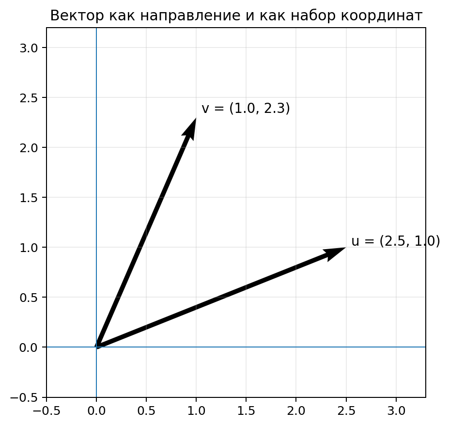
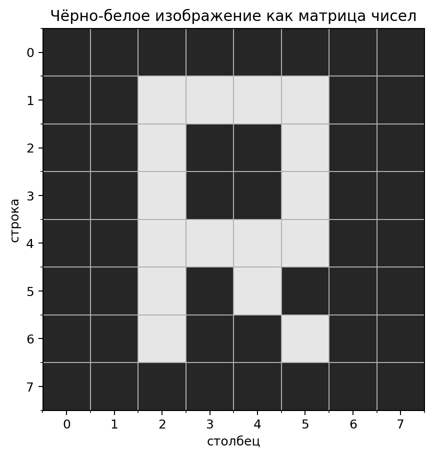
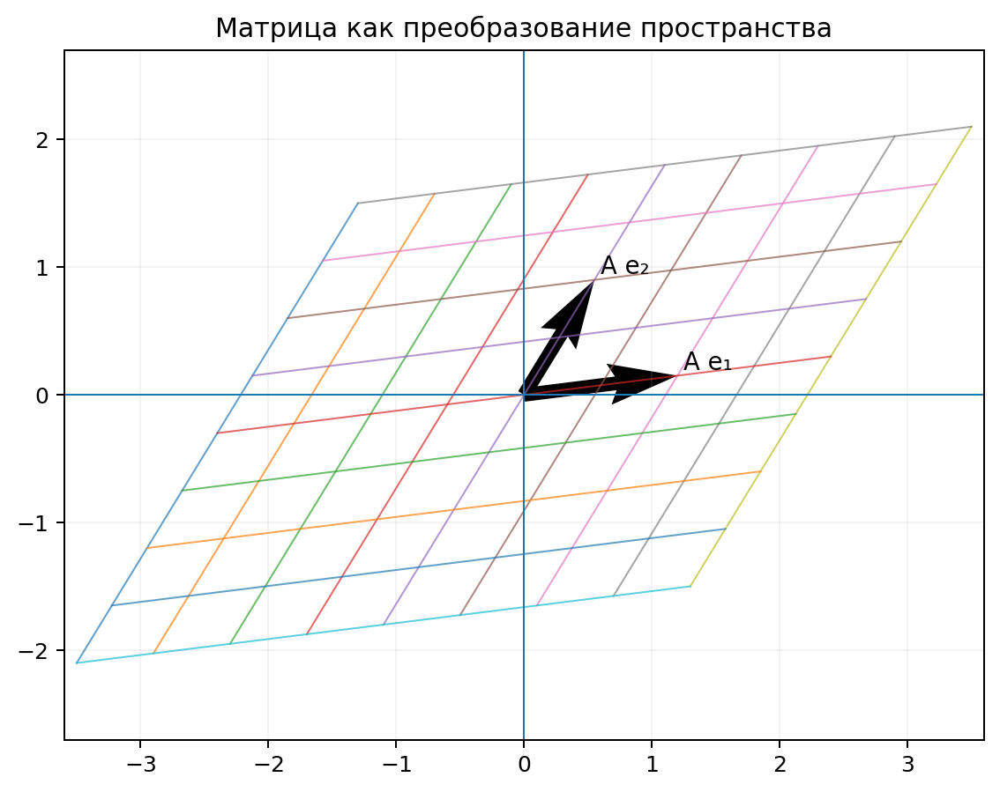

# Векторы и матрицы: язык данных и нейросетей

Модели искусственного интеллекта работают не с фотографиями, словами и звуками напрямую, а с числами. Фотография превращается в массив яркостей пикселей, текст — в последовательность числовых представлений, характеристики объекта — в набор признаков. Чтобы удобно описывать и обрабатывать такие данные, используется язык линейной алгебры: **векторы**, **матрицы** и операции над ними.

Эти понятия важны не только потому, что они часто встречаются в формулах. Практически каждый слой нейронной сети выполняет действия, которые можно записать как умножение матрицы на вектор, сложение с другим вектором и применение нелинейной функции. Векторы используются для представления признаков и embeddings, а матрицы — для хранения наборов данных и параметров моделей.

В этой главе мы начнём с простых объектов — скаляров и векторов, разберём длину и скалярное произведение, затем перейдём к матрицам, умножению матриц на векторы и увидим, как из этих операций складывается работа нейросети.

---

## 1. От реального объекта к набору чисел

Представим, что нужно построить модель, которая оценивает вероятность поступления школьника на образовательную программу. Модель может учитывать несколько признаков:

- средний балл;
- результат экзамена;
- число выполненных проектов;
- количество олимпиад.

Для одного ученика эти данные можно записать так:

```math
(4.7, 88, 3, 2).
```


Такой набор уже можно передать алгоритму.

Если мы работаем с фотографией, числами будут значения пикселей. Если работаем со звуком — значения амплитуды сигнала или вычисленные из него признаки. Если работаем с текстом — числовые представления слов или фрагментов текста.

Главная идея одинакова:

```math
\text{объект реального мира}\longrightarrow\text{набор чисел}.
```


Линейная алгебра позволяет работать с такими наборами как с едиными математическими объектами.

---

## 2. Скаляр

**Скаляр** — это одно число.

Например,

```math
a=5,
```


```math
t=18.7,
```


```math
p=0.92.
```


Скаляр может описывать температуру, цену, вероятность, возраст, длину или любой другой признак, который задаётся одним числом.

В формулах машинного обучения скалярами часто являются:

- отдельные признаки;
- коэффициенты;
- значения функции ошибки;
- скорость обучения $\eta$.

---

## 3. Вектор

**Вектор** — это упорядоченный набор чисел.

Например,

```math
\mathbf{x}=
\begin{bmatrix}
2\\
5\\
-1
\end{bmatrix}.
```


У этого вектора три компоненты. Поэтому говорят, что он принадлежит трёхмерному пространству:

```math
\mathbf{x}\in\mathbb{R}^3.
```


Запись $\mathbb{R}^3$ означает множество всех векторов из трёх действительных чисел.

### Вектор как набор признаков

Пусть объект описывается ростом, весом и возрастом:

```math
\mathbf{x}=
\begin{bmatrix}
170\\
65\\
16
\end{bmatrix}.
```


Здесь первая координата — рост, вторая — вес, третья — возраст.

Смысл вектора определяется не только числами, но и тем, что означает каждая позиция. Если поменять координаты местами, получится другой объект с другим смыслом.

### Геометрическое представление

Вектор из двух чисел можно изобразить как направленный отрезок на плоскости.



Например,

```math
\mathbf{v}=
\begin{bmatrix}
3\\
2
\end{bmatrix}
```


можно представить как перемещение на $3$ единицы вправо и на $2$ единицы вверх.

Для векторов из трёх координат используется трёхмерное пространство. Для векторов из сотен или тысяч координат геометрическая картинка уже недоступна зрению, но математические правила остаются теми же.

---

## 4. Сложение векторов

Складывать можно векторы одинаковой размерности.

Пусть

```math
\mathbf{a}=
\begin{bmatrix}
2\\
1
\end{bmatrix},
\qquad
\mathbf{b}=
\begin{bmatrix}
-1\\
3
\end{bmatrix}.
```


Тогда

```math
\mathbf{a}+\mathbf{b}=
\begin{bmatrix}
2+(-1)\\
1+3
\end{bmatrix}
=
\begin{bmatrix}
1\\
4
\end{bmatrix}.
```


В общем виде:

```math
\begin{bmatrix}
a_1\\
a_2\\
\vdots\\
a_n
\end{bmatrix}
+
\begin{bmatrix}
b_1\\
b_2\\
\vdots\\
b_n
\end{bmatrix}
=
\begin{bmatrix}
a_1+b_1\\
a_2+b_2\\
\vdots\\
a_n+b_n
\end{bmatrix}.
```


Сложение векторов часто возникает в нейросетях. Например, к результату линейного преобразования добавляют вектор смещений $\mathbf{b}$.

---

## 5. Умножение вектора на число

Вектор можно умножить на скаляр.

Если

```math
\mathbf{a}=
\begin{bmatrix}
2\\
1
\end{bmatrix},
```


то

```math
3\mathbf{a}=
\begin{bmatrix}
6\\
3
\end{bmatrix}.
```


Каждая координата умножается на одно и то же число.

Геометрически умножение на положительное число меняет длину вектора. Если множитель больше единицы, вектор удлиняется. Если он находится между $0$ и $1$, вектор укорачивается. При умножении на отрицательное число направление дополнительно меняется на противоположное.

---

## 6. Длина вектора

Для двумерного вектора

```math
\mathbf{x}=
\begin{bmatrix}
x_1\\
x_2
\end{bmatrix}
```


длина вычисляется по теореме Пифагора:

```math
\|\mathbf{x}\|=\sqrt{x_1^2+x_2^2}.
```


Для $n$ координат формула имеет тот же смысл:

```math
\boxed{\|\mathbf{x}\|_2=\sqrt{x_1^2+x_2^2+\dots+x_n^2}}.
```


Например,

```math
\mathbf{x}=
\begin{bmatrix}
3\\
4
\end{bmatrix}.
```


Тогда

```math
\|\mathbf{x}\|=\sqrt{3^2+4^2}=5.
```


Длину вектора также называют **нормой**. Индекс $2$ указывает на евклидову норму.

---

## 7. Расстояние между векторами

Если два объекта представлены векторами, можно измерить расстояние между ними.

Пусть

```math
\mathbf{a}=
\begin{bmatrix}
1\\
2
\end{bmatrix},
\qquad
\mathbf{b}=
\begin{bmatrix}
4\\
6
\end{bmatrix}.
```


Сначала найдём разность:

```math
\mathbf{b}-\mathbf{a}=
\begin{bmatrix}
3\\
4
\end{bmatrix}.
```


Затем её длину:

```math
\|\mathbf{b}-\mathbf{a}\|=5.
```


Поэтому евклидово расстояние между двумя векторами определяется как

```math
\boxed{d(\mathbf{a},\mathbf{b})=\|\mathbf{a}-\mathbf{b}\|_2}.
```


### Зачем это нужно в ИИ

Если близкие векторы соответствуют похожим объектам, расстояние можно использовать для поиска ближайших соседей, кластеризации и рекомендаций.

Но здесь есть важная деталь: признаки должны иметь сопоставимые масштабы. Если один признак измеряется в единицах от $0$ до $1$, а другой — в тысячах, второй будет почти полностью определять расстояние. Поэтому данные часто предварительно нормируют или стандартизуют.

---

## 8. Скалярное произведение

Одна из важнейших операций над векторами — **скалярное произведение**.

Для

```math
\mathbf{a}=
\begin{bmatrix}
a_1\\
a_2\\
\vdots\\
a_n
\end{bmatrix},
\qquad
\mathbf{b}=
\begin{bmatrix}
b_1\\
b_2\\
\vdots\\
b_n
\end{bmatrix}
```


оно определяется формулой

```math
\boxed{\mathbf{a}\cdot\mathbf{b}=a_1b_1+a_2b_2+\dots+a_nb_n}.
```


Например,

```math
\begin{bmatrix}
2\\
3
\end{bmatrix}
\cdot
\begin{bmatrix}
4\\
-1
\end{bmatrix}
=2\cdot4+3\cdot(-1)=5.
```


Обратите внимание: результат скалярного произведения — число, то есть скаляр.

---

## 9. Геометрический смысл скалярного произведения

Скалярное произведение связано с углом между векторами:

```math
\mathbf{a}\cdot\mathbf{b}
=
\|\mathbf{a}\|\,\|\mathbf{b}\|\cos\theta,
```


где $\theta$ — угол между ними.

Отсюда можно сделать несколько выводов.

Если угол маленький, $\cos\theta$ положителен и близок к $1$. Скалярное произведение положительно и велико.

Если векторы перпендикулярны, то

```math
\theta=90^\circ,
```


```math
\cos90^\circ=0,
```


поэтому

```math
\mathbf{a}\cdot\mathbf{b}=0.
```


Если векторы направлены почти противоположно, скалярное произведение отрицательно.

---

## 10. Косинусное сходство

Если нас интересует сходство направлений, а не длина векторов, удобно использовать **косинусное сходство**:

```math
\boxed{\cos\theta=\frac{\mathbf{a}\cdot\mathbf{b}}{\|\mathbf{a}\|\|\mathbf{b}\|}}.
```


Значение близкое к $1$ означает, что направления похожи. Значение около $0$ означает, что направления почти независимы геометрически. Значение близкое к $-1$ соответствует противоположным направлениям.

В задачах обработки текста косинусное сходство часто применяют для сравнения embeddings — векторных представлений слов, предложений и документов.

---

## 11. Искусственный нейрон как скалярное произведение

Рассмотрим входной вектор

```math
\mathbf{x}=
\begin{bmatrix}
x_1\\
x_2\\
x_3
\end{bmatrix}
```


и вектор весов

```math
\mathbf{w}=
\begin{bmatrix}
w_1\\
w_2\\
w_3
\end{bmatrix}.
```


Простейший искусственный нейрон сначала вычисляет

```math
z=w_1x_1+w_2x_2+w_3x_3+b.
```


Но первые три слагаемых — это скалярное произведение:

```math
\mathbf{w}\cdot\mathbf{x}=w_1x_1+w_2x_2+w_3x_3.
```


Поэтому формулу можно записать компактно:

```math
\boxed{z=\mathbf{w}\cdot\mathbf{x}+b}.
```


Затем к $z$ применяют функцию активации, например ReLU:

```math
a=\mathrm{ReLU}(z).
```


Получается, что скалярное произведение — одна из базовых операций нейросети.

---

## 12. Матрица

**Матрица** — прямоугольная таблица чисел.

Например,

```math
A=
\begin{bmatrix}
1&2&3\\
4&5&6
\end{bmatrix}.
```


У этой матрицы две строки и три столбца. Говорят, что её размер или форма равна

```math
2\times3.
```


Можно записать

```math
A\in\mathbb{R}^{2\times3}.
```


Элемент матрицы обычно обозначают $a_{ij}$, где $i$ — номер строки, а $j$ — номер столбца.

Для матрицы выше:

```math
a_{12}=2,
```


```math
a_{23}=6.
```


---

## 13. Набор данных как матрица

Пусть у нас есть три объекта, каждый описан четырьмя признаками.

Их можно записать матрицей

```math
X=
\begin{bmatrix}
1.2&5.0&0.3&7\\
0.8&4.1&0.6&5\\
1.5&5.4&0.2&8
\end{bmatrix}.
```


Одна распространённая договорённость:

- строки — объекты;
- столбцы — признаки.

Тогда форма матрицы $3\times4$ означает, что в наборе три объекта и четыре признака.

На практике библиотека может использовать другую организацию данных, особенно для изображений и нейросетей. Поэтому важно не просто видеть числа, а всегда следить за **shape** — формой массива.

---

## 14. Изображение как матрица

Чёрно-белое изображение можно представить матрицей яркостей.



Каждая ячейка соответствует одному пикселю.

Например, маленькое изображение $4\times4$ может быть записано так:

```math
I=
\begin{bmatrix}
0&0&1&1\\
0&1&1&0\\
1&1&0&0\\
1&0&0&0
\end{bmatrix}.
```


Если $0$ означает чёрный пиксель, а $1$ — белый, матрица полностью задаёт картинку.

У настоящих изображений значения обычно имеют больше градаций. Например, яркость может кодироваться числами от $0$ до $255$.

### Цветное изображение

Цветное изображение содержит несколько каналов, обычно красный, зелёный и синий. Поэтому для него недостаточно одной двумерной матрицы. Нужен многомерный массив.

Например, изображение размером $224\times224$ пикселей с тремя каналами может иметь форму

```math
224\times224\times3.
```


Такой объект обычно называют **тензором**.

---

## 15. Тензор

В машинном обучении словом **тензор** часто называют многомерный массив чисел.

Удобно мыслить так:

- скаляр — ноль осей;
- вектор — одна ось;
- матрица — две оси;
- тензор более высокого порядка — три и более осей.

Например, пакет из $32$ цветных изображений размера $224\times224$ может иметь форму

```math
32\times224\times224\times3.
```


Первая ось — номер изображения в пакете.

В разных библиотеках порядок осей может отличаться. Например, каналы могут стоять до высоты и ширины. Поэтому размерности нужно проверять явно.

---

## 16. Сложение матриц

Матрицы одинаковой формы складываются поэлементно.

Пусть

```math
A=
\begin{bmatrix}
1&2\\
3&4
\end{bmatrix},
\qquad
B=
\begin{bmatrix}
5&6\\
7&8
\end{bmatrix}.
```


Тогда

```math
A+B=
\begin{bmatrix}
6&8\\
10&12
\end{bmatrix}.
```


Если формы различаются, обычное матричное сложение не определено.

В программах иногда работает механизм **broadcasting**, который позволяет автоматически растягивать массив меньшей размерности. Это полезно, но на математическом уровне важно понимать, какая операция фактически выполняется.

---

## 17. Умножение матрицы на вектор

Рассмотрим матрицу

```math
A=
\begin{bmatrix}
1&2\\
3&4
\end{bmatrix}
```


и вектор

```math
\mathbf{x}=
\begin{bmatrix}
5\\
6
\end{bmatrix}.
```


Произведение $A\mathbf{x}$ вычисляется так:

```math
A\mathbf{x}=
\begin{bmatrix}
1\cdot5+2\cdot6\\
3\cdot5+4\cdot6
\end{bmatrix}
=
\begin{bmatrix}
17\\
39
\end{bmatrix}.
```


Каждая строка матрицы образует скалярное произведение с входным вектором.

Если

```math
A\in\mathbb{R}^{m\times n}
```


и

```math
\mathbf{x}\in\mathbb{R}^{n},
```


то результат

```math
A\mathbf{x}\in\mathbb{R}^{m}.
```


То есть число столбцов матрицы должно совпадать с длиной входного вектора.

---

## 18. Матрица как преобразование пространства

Умножение на матрицу можно понимать не только как набор арифметических действий, но и как преобразование вектора.

Матрица может:

- растягивать пространство;
- сжимать его;
- поворачивать;
- отражать;
- смешивать координаты.



Например,

```math
A=
\begin{bmatrix}
2&0\\
0&1
\end{bmatrix}
```


умножает первую координату на $2$ и оставляет вторую без изменений. Геометрически это растяжение по горизонтали.

Матрица

```math
B=
\begin{bmatrix}
0&-1\\
1&0
\end{bmatrix}
```


поворачивает двумерный вектор на $90^\circ$ против часовой стрелки.

Именно поэтому матрицы так удобны: одна таблица чисел задаёт преобразование сразу всего пространства входных признаков.

---

## 19. Формула слоя нейросети

Пусть на вход слоя приходит вектор

```math
\mathbf{x}\in\mathbb{R}^{n}.
```


Слой должен вычислить $m$ новых чисел. Для этого используется матрица весов

```math
W\in\mathbb{R}^{m\times n}
```


и вектор смещений

```math
\mathbf{b}\in\mathbb{R}^{m}.
```


Сначала вычисляют

```math
\mathbf{z}=W\mathbf{x}+\mathbf{b}.
```


Затем обычно применяют функцию активации:

```math
\mathbf{a}=\varphi(\mathbf{z}).
```


Компактная запись слоя:

```math
\boxed{\mathbf{a}=\varphi(W\mathbf{x}+\mathbf{b})}.
```


Эта формула — одна из центральных формул нейронных сетей.

### Почему матрица весов имеет размер $m\times n$

Вход содержит $n$ чисел. Каждый из $m$ выходных нейронов должен получить собственное скалярное произведение с входом, то есть собственный набор из $n$ весов.

Поэтому матрица содержит $m$ строк по $n$ весов:

```math
W=
\begin{bmatrix}
---\mathbf{w}_1^T---\\
---\mathbf{w}_2^T---\\
\vdots\\
---\mathbf{w}_m^T---
\end{bmatrix}.
```


Каждая строка отвечает одному выходному нейрону.

---

## 20. Числовой пример слоя

Пусть

```math
\mathbf{x}=
\begin{bmatrix}
2\\
1\\
3
\end{bmatrix},
```


```math
W=
\begin{bmatrix}
1&0&-1\\
2&1&0
\end{bmatrix},
```


```math
\mathbf{b}=
\begin{bmatrix}
1\\
-2
\end{bmatrix}.
```


Форма $W$ равна $2\times3$. Значит, слой получает $3$ входных признака и создаёт $2$ выходных значения.

Вычислим

```math
W\mathbf{x}=
\begin{bmatrix}
1\cdot2+0\cdot1-1\cdot3\\
2\cdot2+1\cdot1+0\cdot3
\end{bmatrix}
=
\begin{bmatrix}
-1\\
5
\end{bmatrix}.
```


Добавим смещение:

```math
\mathbf{z}=W\mathbf{x}+\mathbf{b}=
\begin{bmatrix}
0\\
3
\end{bmatrix}.
```


Если применить ReLU поэлементно,

```math
\mathrm{ReLU}(z)=\max(0,z),
```


то

```math
\mathbf{a}=
\begin{bmatrix}
0\\
3
\end{bmatrix}.
```


Весь слой можно вычислить несколькими компактными матричными операциями.

---

## 21. Умножение матриц

Пусть

```math
A\in\mathbb{R}^{m\times n}
```


и

```math
B\in\mathbb{R}^{n\times p}.
```


Тогда произведение

```math
C=AB
```


существует и имеет форму

```math
C\in\mathbb{R}^{m\times p}.
```


Ключевое правило размерностей:

```math
(m\times n)(n\times p)\rightarrow(m\times p).
```


Внутренние размеры должны совпадать.

### Пример

```math
A=
\begin{bmatrix}
1&2\\
3&4
\end{bmatrix},
\qquad
B=
\begin{bmatrix}
5&6\\
7&8
\end{bmatrix}.
```


Тогда

```math
AB=
\begin{bmatrix}
1\cdot5+2\cdot7 & 1\cdot6+2\cdot8\\
3\cdot5+4\cdot7 & 3\cdot6+4\cdot8
\end{bmatrix}
=
\begin{bmatrix}
19&22\\
43&50
\end{bmatrix}.
```


Важно: в общем случае

```math
AB\ne BA.
```


Порядок умножения матриц имеет значение.

---

## 22. Пакет объектов и матричные вычисления

Если у нас не один входной объект, а сразу много, необязательно обрабатывать каждый отдельно.

Пусть $X$ содержит несколько объектов. Тогда библиотека линейной алгебры может выполнить преобразование для всего набора одной матричной операцией.

Именно это делает обучение нейросетей эффективным на современных процессорах и видеокартах: вместо большого числа отдельных циклов выполняются крупные параллельные операции над массивами.

Поэтому изучение матриц — это не только вопрос удобной записи. Матричная форма напрямую связана с тем, как вычисления реализуются на компьютере.

---

## 23. Embeddings: объекты как точки в пространстве

Во многих современных моделях слова, предложения, изображения или пользователи представляются векторами большой размерности. Такие представления называют **embeddings**.

Например, слово может быть представлено как

```math
\mathbf{e}_{\text{cat}}=
\begin{bmatrix}
0.12\\
-0.47\\
0.88\\
\vdots
\end{bmatrix}.
```


Отдельные координаты обычно не имеют простого человеческого названия. Важна структура всего пространства: объекты с похожим смыслом оказываются в нём близко или имеют близкие направления.

Например, embedding запроса можно сравнивать с embeddings документов и выбирать наиболее похожие. Эта идея лежит в основе семантического поиска и многих рекомендательных систем.

---

## 24. Почему нормировка векторов бывает полезна

Представим два вектора одинакового направления:

```math
\mathbf{a}=
\begin{bmatrix}
1\\
2
\end{bmatrix},
\qquad
\mathbf{b}=
\begin{bmatrix}
10\\
20
\end{bmatrix}.
```


Геометрически они направлены одинаково, но их длины сильно различаются.

Если нас интересует только направление, можно нормировать вектор, разделив его на длину:

```math
\hat{\mathbf{x}}=\frac{\mathbf{x}}{\|\mathbf{x}\|}.
```


После такой операции длина становится равной $1$.

Нормированные векторы особенно удобны при сравнении по косинусному сходству.

---

## 25. Транспонирование

Если строки матрицы поменять местами со столбцами, получится транспонированная матрица.

Для

```math
A=
\begin{bmatrix}
1&2&3\\
4&5&6
\end{bmatrix}
```


имеем

```math
A^T=
\begin{bmatrix}
1&4\\
2&5\\
3&6
\end{bmatrix}.
```


Форма изменилась с $2\times3$ на $3\times2$.

Транспонирование часто появляется при переходе между строковой и столбцовой записью векторов и при построении формул для пакетных вычислений.

---

## 26. Единичная матрица

Единичная матрица — квадратная матрица, у которой на главной диагонали стоят единицы, а остальные элементы равны нулю.

Например,

```math
I=
\begin{bmatrix}
1&0\\
0&1
\end{bmatrix}.
```


Она играет для матриц роль числа $1$:

```math
I\mathbf{x}=\mathbf{x},
```


```math
IA=A,
```


```math
AI=A
```


для совместимых размерностей.

---

## 27. Связь с производными и градиентом

В предыдущей теме мы встретили градиент функции ошибки:

```math
\nabla L=
\begin{bmatrix}
\frac{\partial L}{\partial w_1}\\
\frac{\partial L}{\partial w_2}\\
\vdots\\
\frac{\partial L}{\partial w_n}
\end{bmatrix}.
```


Теперь видно, что градиент — это обычный вектор.

Вектор параметров модели можно записать как

```math
\mathbf{w}=
\begin{bmatrix}
w_1\\
w_2\\
\vdots\\
w_n
\end{bmatrix}.
```


Тогда шаг градиентного спуска принимает компактный вид:

```math
\boxed{\mathbf{w}_{\text{new}}=\mathbf{w}_{\text{old}}-\eta\nabla L}.
```


То есть обучение можно интерпретировать как движение точки в многомерном пространстве параметров.

---

## 28. Почему линейной части недостаточно

Если каждый слой нейросети состоял бы только из линейного преобразования

```math
\mathbf{y}=W\mathbf{x},
```


то последовательность нескольких таких слоёв всё равно можно было бы свернуть в одно линейное преобразование.

Например,

```math
\mathbf{y}=W_2(W_1\mathbf{x})=(W_2W_1)\mathbf{x}.
```


Поэтому между линейными слоями добавляют нелинейные функции активации:

```math
\mathbf{a}=\varphi(W\mathbf{x}+\mathbf{b}).
```


Именно нелинейность позволяет сети описывать сложные зависимости.

Так соединяются две темы курса: матрицы отвечают за линейные преобразования, а функции активации делают модель нелинейной.

---

## 29. Типичные ошибки при работе с матрицами

### Ошибка 1. Игнорировать размерности

Перед умножением всегда полезно записать формы:

```math
W:(m\times n),\qquad \mathbf{x}:(n\times1).
```


Тогда сразу видно, что

```math
W\mathbf{x}:(m\times1).
```


### Ошибка 2. Путать поэлементное и матричное умножение

В матричном произведении элементы не просто перемножаются на тех же позициях. Используются строки первой матрицы и столбцы второй.

### Ошибка 3. Считать, что $AB=BA$

Для матриц перестановка множителей обычно меняет результат или вообще делает произведение невозможным.

### Ошибка 4. Сравнивать признаки без учёта масштаба

Евклидово расстояние чувствительно к масштабу координат. Перед сравнением объектов данные часто требуется нормировать.

### Ошибка 5. Думать, что координаты embedding имеют очевидный смысл

Смысл embedding обычно распределён по многим координатам. Важны отношения между векторами, а не попытка дать каждой координате отдельное словесное толкование.

---

## 30. Как связаны все идеи главы

Теперь можно собрать общую картину.

1. Реальные данные переводятся в числа.
2. Набор признаков одного объекта удобно хранить как вектор.
3. Набор объектов можно хранить как матрицу или тензор.
4. Вектор можно сравнивать с другими векторами по расстоянию или направлению.
5. Скалярное произведение объединяет признаки с весами.
6. Матрица содержит множество наборов весов и сразу вычисляет несколько выходных значений.
7. Полносвязный слой нейросети записывается как $\mathbf{a}=\varphi(W\mathbf{x}+\mathbf{b})$.
8. Параметры модели и их градиенты сами являются векторами и матрицами.
9. Обучение модели означает изменение этих числовых объектов так, чтобы уменьшить функцию ошибки.

Линейная алгебра поэтому является не отдельной теоретической темой, а рабочим языком современной машинной модели.

---

## 31. Вопросы для самопроверки

1. Чем скаляр отличается от вектора?
2. Что означает запись $\mathbf{x}\in\mathbb{R}^5$?
3. Как складываются два вектора?
4. Как вычисляется евклидова длина вектора?
5. Как найти расстояние между двумя векторами?
6. Что такое скалярное произведение?
7. Как скалярное произведение связано с углом между векторами?
8. Для чего используют косинусное сходство?
9. Что означает форма матрицы $3\times7$?
10. Когда произведение $A\mathbf{x}$ определено?
11. Почему строку матрицы весов можно считать весами одного нейрона?
12. Как записывается полносвязный слой нейросети?
13. Что такое tensor в контексте машинного обучения?
14. Что такое embedding?
15. Почему порядок умножения матриц важен?
16. Почему между линейными слоями нужны нелинейные функции активации?

#### Краткие ответы


1. Скаляр — одно число, вектор — упорядоченный набор чисел.
2. Вектор содержит пять действительных координат.
3. Поэлементно.
4. $\|\mathbf{x}\|_2=\sqrt{x_1^2+\dots+x_n^2}$.
5. $\|\mathbf{a}-\mathbf{b}\|_2$.
6. Сумма произведений соответствующих координат.
7. $\mathbf{a}\cdot\mathbf{b}=\|\mathbf{a}\|\|\mathbf{b}\|\cos\theta$.
8. Для сравнения направлений векторов, например embeddings.
9. Три строки и семь столбцов.
10. Когда длина $\mathbf{x}$ совпадает с числом столбцов $A$.
11. Каждая строка образует собственное скалярное произведение с входом.
12. $\mathbf{a}=\varphi(W\mathbf{x}+\mathbf{b})$.
13. Многомерный массив чисел.
14. Векторное представление объекта в некотором пространстве признаков.
15. В общем случае $AB\ne BA$.
16. Без нелинейностей несколько линейных слоёв эквивалентны одному линейному преобразованию.


---

## 32. Для дальнейшего изучения

- 3Blue1Brown — *Essence of Linear Algebra*: <https://www.3blue1brown.com/topics/linear-algebra>
- MIT OpenCourseWare — Linear Algebra: <https://ocw.mit.edu/courses/18-06sc-linear-algebra-fall-2011/>
- *Deep Learning*, Ian Goodfellow, Yoshua Bengio, Aaron Courville — Chapter 2: <https://www.deeplearningbook.org/contents/linear_algebra.html>

---

**Предыдущая тема:** [Функции и производные](01_functions_and_derivatives_lecture.md)
